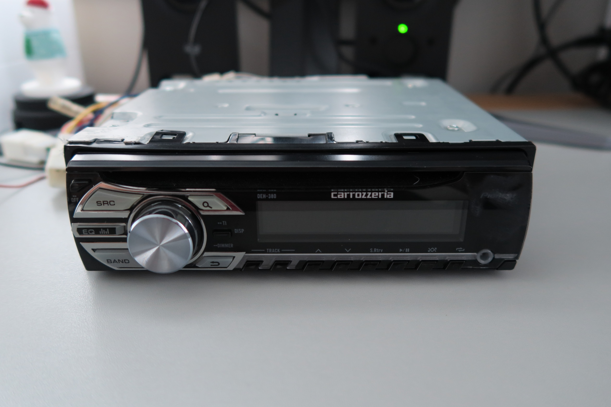
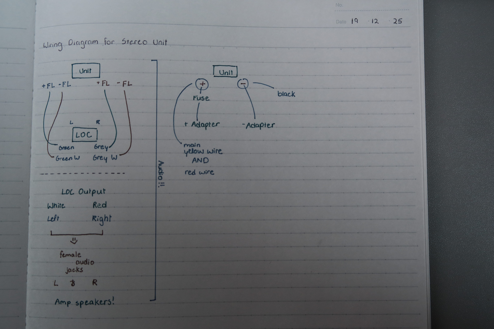
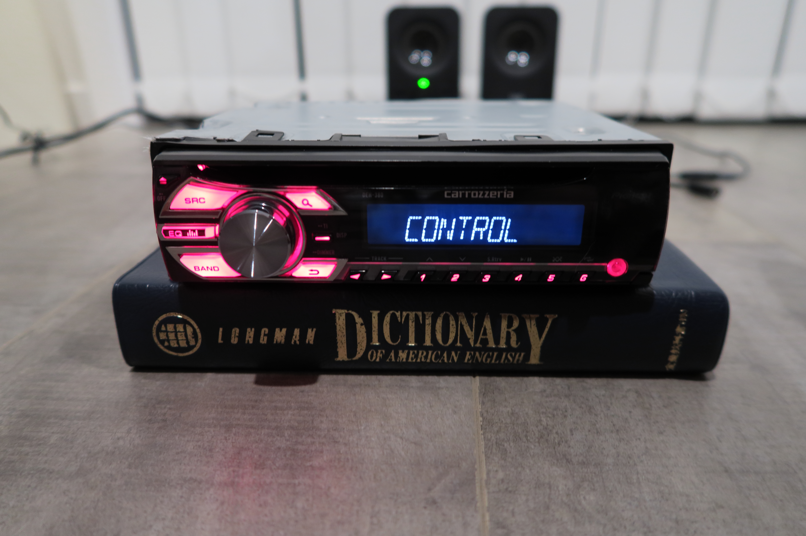
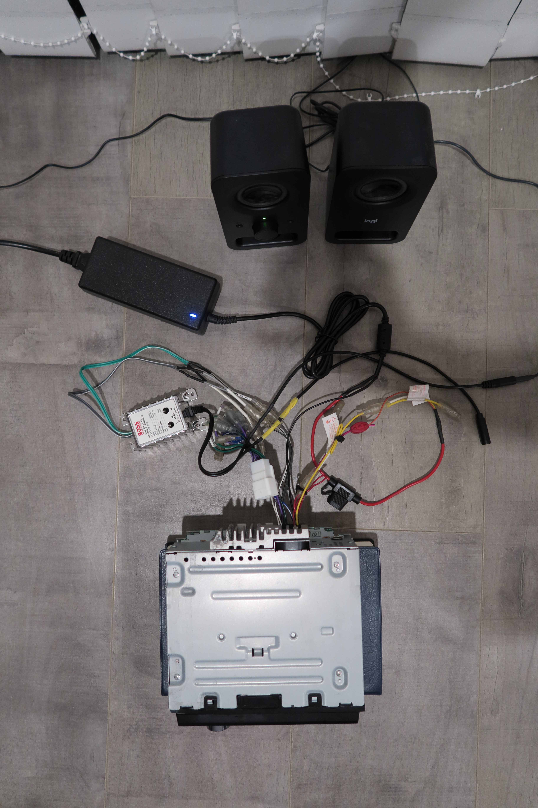
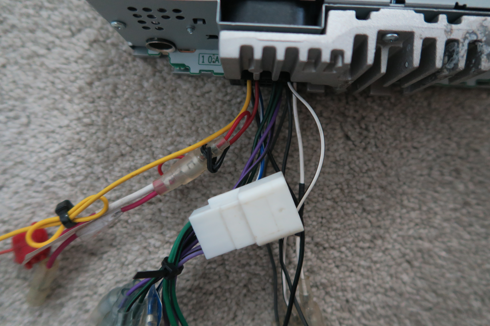
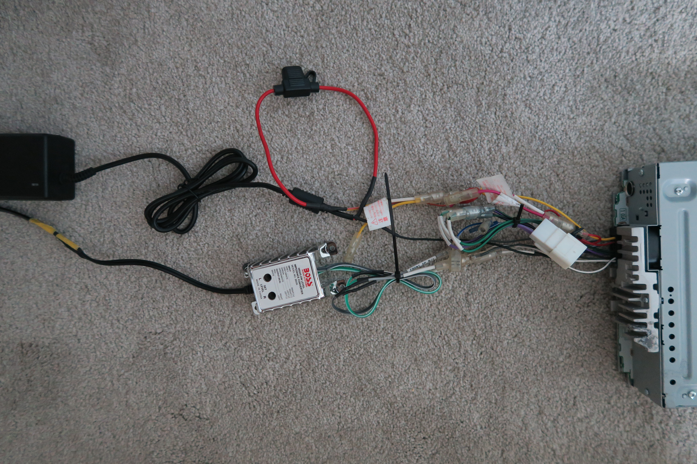


> My YouTube video showcasing the project which includes parts of some of the processes.
> 
---

A simple yet entertaining project with a fun result!
For the past few years, I’ve purchased albums but never listened to the music using the provided CDs. After all a decent CD player goes for about $100… 

So I decided it would be more economical if I spend the same amount but I make it myself!

---



## Process

For this project, the process was relatively straightforward.

- Research the specific model of stereo unit I purchased
    - Figure out its wiring
    - Research on what parts it will require
- Acquire parts
- Assemble!

---

## Research

<a href="researchForCarsStereo.pdf" target="_blank" rel="noopener noreferrer">Research paper.</a>

Parts and theory in this project will be recorded in the above document!

--- 

## Development

In order to start this project, I first had to purchase a car stereo. I got mine from Trade Me second hand in good condition for $20.


 > This video was especially helpful on getting started. He explains a bit of the wiring and processes.
>

As the stereo I purchased is a different model, I found further resources that would help me understand the different wires further.


> This video explains the different coloured wires on the mentioned car stereo models.
> 

As I had no prior knowledge of wiring audio cables and car stereos in general, researching about different components took some time.

### BOM

First, I brainstormed some additional components that I would need for the project. For instance, I wanted to be able to plug in my Logitech speaker. Speaker types are divided into two types, active and passive.[^1]  To put it short, I had an active speaker for a setup that required a passive speaker. To bridge this gap, a line output converter was required.

Additionally, I needed a bare ended female audio jack to plug the speakers in. With extra components, the list looked something like this:

- Car Stereo
- Speaker (active)
- 5A Fuse
- Fuse holder
- Line output converter (LOC)
- 3.5mm female audio jack to bare wire

[^1]: You can find more on this in the research document!

### Wiring

After watching a few videos, I understood what had to be wired in order for the stereo to work. Additionally, I  used language models to identify slightly different wires that my stereo had. 

Next, I stripped the tips of wires to solder them.
The speaker wires from the stereo unit were shielded, which was fine as they were just grounded into the ground in the stereo.

After soldering, all that was left was to plug the power and speakers in.

---

## Result
As the assembly was quite simple, it was relatively easy and quick to finish. 

### Product

---

## Future Directions
Ultimately, I was quite satisfied with the outcome. However, there are some aspects that could have been improved. 

1) I mistook my speakers to have two output jacks, when in reality they have one audio out put and one power cable. Therefore, as you see, in the final product I have two female audio jacks. 

2) Noise. As mentioned, the audio cables were shielded. My carelessness when soldering them to the ground cable may have detered the effectiveness of it. I assume this is why there is so much noise. 

---

## Outro
Thank you for taking your time to read my blog! 